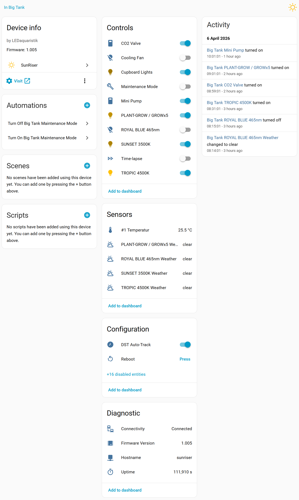

#  SunRiser Home Assistant Integration

A community-made Home Assistant custom integration for the [SunRiser 8/10](https://www.ledaquaristik.de/SunRiser-10-Dimmsteuerung-und-Tagessimulation-mit-WLAN/150-00) LED aquarium controller by LEDaquaristik.

Connects HA to the controller over HTTP using the [MessagePack](https://msgpack.org/) binary protocol. Each active PWM channel gets one or more entities (light, switch, select, number), and there are service actions for backup, restore, scheduling, and diagnostics.

**Full documentation:** [mrinterbugs.github.io/ha-sunriser](https://mrinterbugs.github.io/ha-sunriser/)

## Quick install

1. Add `https://github.com/MrInterBugs/ha-sunriser` as a custom repository in HACS (category: Integration)
2. Search for **SunRiser** in HACS and click **Download**
3. Restart Home Assistant
4. Go to **Settings → Devices & Services → Add Integration** and search for **SunRiser**

See the [installation docs](https://mrinterbugs.github.io/ha-sunriser/installation/) for the full walkthrough.

## License

[GNU GPLv3](LICENSE)

## Attribution

This integration was built using the [SunRiser source code](https://github.com/LEDaquaristik/sunriser) by [LEDaquaristik](https://www.ledaquaristik.de/) as reference material. The source code and configuration files from that project are licensed under the [GNU GPL v3](http://www.gnu.org/licenses/gpl-3.0). Other assets (graphics etc.) are licensed under [CC BY 4.0](http://creativecommons.org/licenses/by/4.0/).

Integration icon derived from the [Feather Icons sun SVG](https://github.com/feathericons/feather/blob/main/icons/sun.svg) (MIT).
