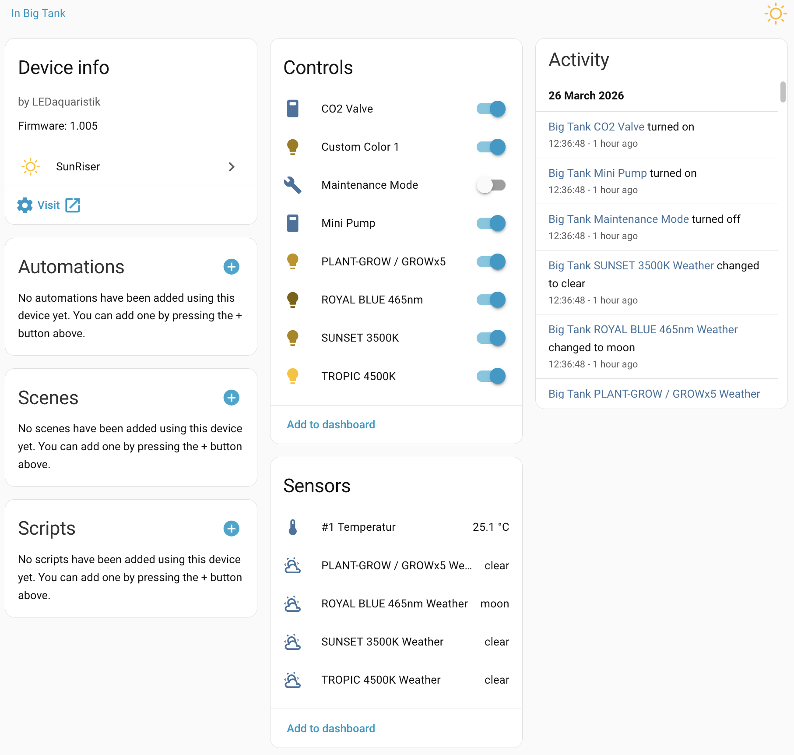
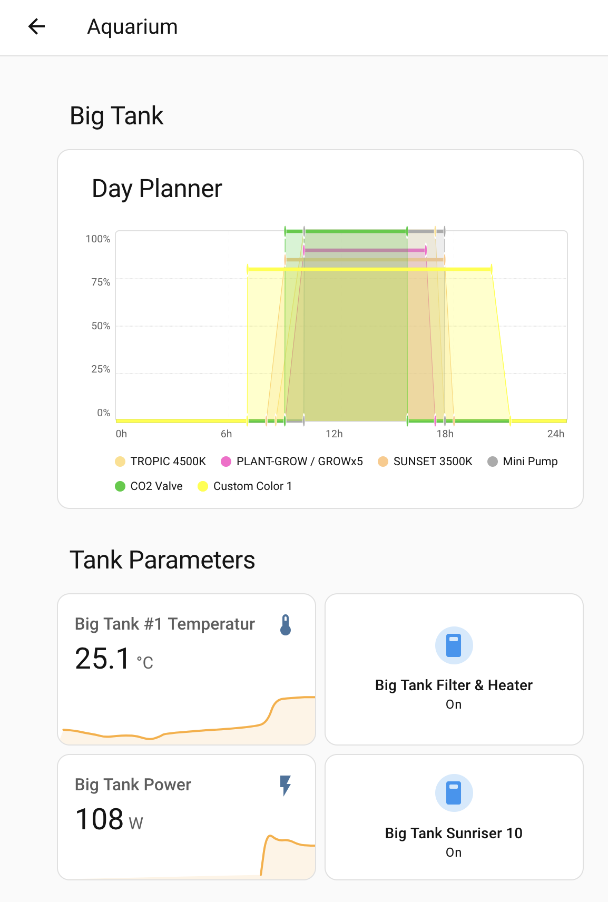

#  SunRiser Home Assistant Integration

A community-made Home Assistant custom integration for the [SunRiser 8/10](https://www.ledaquaristik.de/SunRiser-10-Dimmsteuerung-und-Tagessimulation-mit-WLAN/150-00) LED aquarium controller by LEDaquaristik.

## Features

- **Light** — Dimmable control (0–100%) for each PWM channel configured as a light
- **Switch** — On/off control for PWM channels configured as on/off, plus a **Maintenance Mode** switch
- **Select** — Per-channel manager selector (`none`, `dayplanner`, `weekplanner`, `fixed`) — shows and changes which planner controls each channel
- **Number** — Per-channel fixed value slider (0–1000) used when the channel manager is set to `fixed`
- **Sensor** — DS1820 temperature sensors; weather simulation state per channel; diagnostic sensors for Uptime, Firmware Version, and Hostname
- **Binary Sensor** — Connectivity sensor that reports whether the device responded on the last poll cycle
- **Button** — **Reboot** button to restart the device directly from HA
- **Day Planner card** — built-in Lovelace card that renders all active PWM schedules as a 24-hour chart using the same LED colours as the device web UI; registered automatically, no manual setup required; schedule data is cached at startup so page loads never hit the device
- **Services** — Backup, restore, log retrieval, dayplanner/weekplanner read/write, and factory tools (see [Services](#services) below)
- **Options** — Configurable poll interval (5–3600 seconds, default 60s) and scheduled daily reboot (default 04:00) without re-adding the integration
- Auto-discovery of PWM channels and temperature sensors from the device
- "Visit device" link in the device page opens the SunRiser web UI directly from HA



## Use Cases

### Tank Temperature Monitoring

Include the temperature on your aquarium dashboard alongside other tank sensors. Set an HA alert if the temperature drifts outside your safe range — useful as a backup check independent of any device-side alarms.

### Connectivity Monitoring

The binary sensor tracks whether the SunRiser responded on the last poll. Add it to a dashboard or use it in an HA notification automation so you know immediately if the controller has crashed or lost network — before your lighting program silently stops running.

### Config Backup Before Changes

Before making changes to the device's schedule, call `sunriser.backup` from a HA script to snapshot the current config to your HA config directory. If something goes wrong, `sunriser.restore` sends the saved file back to the device.

### Current Light State at a Glance

The light and switch entities reflect the device's live PWM values, so you can see exactly what each channel is doing right now from your HA dashboard — whether the device is running a dayplanner, a weekplanner, or a manual override.

## Requirements

- Home Assistant 2024.1.0 or newer
- SunRiser 8 or 10 on your local network
- [HACS](https://hacs.xyz/) installed

## Installation via HACS

1. Open HACS in your Home Assistant sidebar
2. Click the **three-dot menu** (top right) and select **Custom repositories**
3. Paste `https://github.com/MrInterBugs/ha-sunriser` into the URL field
4. Set category to **Integration** and click **Add**
5. Search for **SunRiser** in HACS and click **Download**
6. Restart Home Assistant

## Setup

1. Go to **Settings → Devices & Services → Add Integration**
2. Search for **SunRiser**
3. Enter your device's IP address or hostname (default hostname: `sunriser`)
4. Enter the port if you changed it from the default (default: `80`)
5. Click **Submit**

The integration will automatically detect all PWM channels and temperature sensors on your device.

### Updating the Host or Port

If your device's IP address changes, go to **Settings → Devices & Services → SunRiser → three-dot menu → Reconfigure**. You can update the host and port without removing the integration — all automations and entity history are preserved.



## Configuration

### Initial Configuration

| Parameter | Description                                    | Default |
|-----------|------------------------------------------------|---------|
| Host      | IP address or hostname of the SunRiser device  | —       |
| Port      | HTTP port the device listens on                | `80`    |

### Options

After setup, go to **Settings → Devices & Services → SunRiser → Configure** to adjust:

| Option | Description | Range / Format | Default |
|--------|-------------|----------------|---------|
| Poll interval | How often HA fetches the device state | 5–3600 s | 60 s |
| Scheduled daily reboot | Automatically reboot the controller once a day to prevent firmware instability | on / off | on |
| Scheduled reboot time | Time of day to reboot (24-hour format) | HH:MM | 04:00 |

Changing any option reloads the integration automatically — no restart required.

### Automatic Discovery

The integration can discover SunRiser devices automatically via DHCP. When a device with a hostname matching `sunriser*` joins your network, Home Assistant will prompt you to set it up. You can also initiate setup manually via **Settings → Devices & Services → Add Integration → SunRiser**.

## Device Removal and Integration Removal

1. Go to **Settings → Devices & Services**
2. Find the **SunRiser** integration and click the three-dot menu
3. Select **Delete**
4. If installed via HACS, open HACS, find **SunRiser**, and click **Remove**
5. Restart Home Assistant

## Services

The integration registers the following HA services under the `sunriser` domain:

| Service | Description |
|---------|-------------|
| `sunriser.backup` | Downloads all device configuration and saves it to `/config/sunriser_backup_<timestamp>.msgpack`. Returns `{"path": "..."}`. |
| `sunriser.restore` | Restores configuration from a `.msgpack` backup file. Requires `file_path` parameter. The device performs a deep restart after applying. |
| `sunriser.get_errors` | Fetches the device error log. Returns `{"content": "..."}`. |
| `sunriser.get_log` | Fetches the device diagnostic log. Returns `{"content": "..."}`. |
| `sunriser.get_dayplanner_schedule` | Returns the day planner schedule for a PWM channel as `{"pwm": N, "name": "...", "markers": [{"time": "HH:MM", "percent": N}, ...]}`. Served from cache — no device request. |
| `sunriser.set_dayplanner_schedule` | Writes a new day planner schedule for a PWM channel. Accepts `pwm` and a list of `{time, percent}` markers. Changes persist across reboots. |
| `sunriser.get_weekplanner_schedule` | Returns the week planner program assignment for a PWM channel as a dict mapping day names (`sunday`–`saturday`, `default`) to program IDs. |
| `sunriser.set_weekplanner_schedule` | Writes a new week planner schedule for a PWM channel. Accepts `pwm` and a dict of day → program ID. Missing days default to 0. |
| `sunriser.download_factory_backup` | Downloads the factory default configuration via `GET /factorybackup` and saves it as a timestamped `.msgpack` file in the HA config directory. |
| `sunriser.download_firmware` | Downloads firmware info via `GET /firmware.mp` and saves it as a timestamped `.msgpack` file. |
| `sunriser.download_bootload` | Downloads bootloader info via `GET /bootload.mp` and saves it as a timestamped `.msgpack` file. |
| `sunriser.factory_reset` | Resets the device to factory defaults via `DELETE /`. Requires `confirm: true` to prevent accidental use. |

Example — backup and restore via automation:

```yaml
action: sunriser.backup
response_variable: result
# result.path = /config/sunriser_backup_20260323_120000.msgpack

action: sunriser.restore
data:
  file_path: /config/sunriser_backup_20260323_120000.msgpack
```

## Known Limitations & Warnings

> **Warning:** Do not use the SunRiser web interface while this integration is running. The device has limited capacity for concurrent connections, and accessing the web UI at the same time as the integration polls the device can cause the controller to crash and require either a manual power cycle or waiting for the device's watchdog (dead man's switch) to trigger and restart it automatically.

## Troubleshooting

### Cannot Connect to the Device

**Symptom:** Integration setup fails or the connectivity binary sensor stays `Off`.

Check that the SunRiser is on the same network as HA and is reachable. Open `http://<host>/` in a browser — you should see a web page for the device. Ensure no firewall or VLAN is blocking port 80 between HA and the device.

### No Entities Appear After Setup

**Symptom:** The device is found but no light, switch, number, or select entities are created.

This is expected, entities will take up to two minutes to show up when first adding the device otherwise the SunRiser will crash due to too many concurrent requests.

PWM channel entities are only created when the channel has a `color` field set in the device config (an empty `color` means the channel is physically unused). Log into the SunRiser web UI, assign a colour to each active channel, and then reload the integration. Channels will be picked up automatically on the next coordinator poll.

### State Values Stop Updating

**Symptom:** Entity states are stale or show as unavailable.

Check the poll interval under **Settings → Devices & Services → SunRiser → Configure** — a very long interval means infrequent updates. Confirm nothing is blocking HTTP between HA and the device. Avoid using the SunRiser web UI simultaneously with the integration (see Known Limitations).

### Light Brightness Reverts After ~60 Seconds

**Symptom:** Setting a light to a specific brightness from HA works, but then it changes back on its own.

This is expected device behaviour. A direct PWM write from HA overrides the running program for approximately one minute, after which the device's own dayplanner or weekplanner schedule resumes. To keep manual control permanently, use the **Manager** select entity for that channel and set it to `none`.

## Notes

- Values are polled every 60 seconds by default. Change this under **Settings → Devices & Services → SunRiser → Configure**.
- Manually setting a PWM brightness from HA overrides the active program for approximately 1 minute, after which the device's own schedule resumes. Use the Manager select entity to switch a channel to `none` for permanent manual control.
- New temperature sensors discovered after initial setup are added automatically on the next poll — no reload required.

## License

This project is licensed under the [GNU GPLv3](http://www.gnu.org/licenses/gpl-3.0) — see the [LICENSE](LICENSE) file for details.

## Attribution

This integration was built using the [SunRiser source code](https://github.com/LEDaquaristik/sunriser) by [LEDaquaristik](https://www.ledaquaristik.de/) as reference material. The source code and configuration files from that project are licensed under the [GNU GPL v3](http://www.gnu.org/licenses/gpl-3.0). Other assets (graphics etc.) are licensed under [CC BY 4.0](http://creativecommons.org/licenses/by/4.0/).

The integration icon is derived from the [sun icon](https://github.com/feathericons/feather/blob/main/icons/sun.svg) by [Feather Icons](https://feathericons.com), licensed under the [MIT License](https://github.com/feathericons/feather/blob/master/LICENSE).

## Links

- [SunRiser source code](https://github.com/LEDaquaristik/sunriser)
- [SunRiser API documentation](https://github.com/LEDaquaristik/sunriser/blob/master/SUNRISER8_API_DE.md)
- [Report an issue](https://github.com/MrInterBugs/ha-sunriser/issues)
