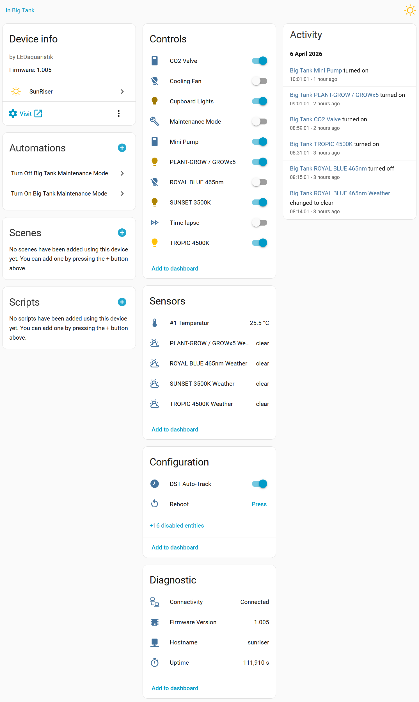

#  SunRiser Home Assistant Integration

A community-made Home Assistant custom integration for the [SunRiser 8/10](https://www.ledaquaristik.de/SunRiser-10-Dimmsteuerung-und-Tagessimulation-mit-WLAN/150-00) LED aquarium controller by LEDaquaristik.

Connects HA to the controller over HTTP using the [MessagePack](https://msgpack.org/) binary protocol. Each active PWM channel gets one or more entities (light, switch, select, number), and there are service actions for backup, restore, scheduling, and diagnostics.

The current release targets **controller firmware 1.006**; compatibility with older firmware is unverified. Home Assistant must be able to reach the controller over your local network.

- Control channel outputs and day/week planners, and monitor temperature, weather simulation, and connectivity.
- Use Maintenance Mode and Blackout Mode, with optional timeout, per-channel level, and exclusion settings. Turning Maintenance Mode off ends either session.
- Assign existing weather profiles through optional per-channel selectors, and view daily and weekly curves together in the compact, read-only Day Planner card.
- View the operating mode and optionally enable Maintenance Ends At. Maintenance configuration entities and the end-time sensor are disabled by default; enable them from the device's entity settings.

See the [configuration guide](https://mrinterbugs.github.io/ha-sunriser/configuration/) for weather-profile selectors and the read-only daily/weekly schedule graph.

See the [maintenance guide](https://mrinterbugs.github.io/ha-sunriser/configuration/#maintenance-and-blackout-firmware-1006) for details. Channels excluded from maintenance/blackout continue normal operation.

**Full documentation:** [mrinterbugs.github.io/ha-sunriser](https://mrinterbugs.github.io/ha-sunriser/)

Use the [service action guide](https://mrinterbugs.github.io/ha-sunriser/services/) for backups, schedules, and diagnostics, or the [troubleshooting guide](https://mrinterbugs.github.io/ha-sunriser/troubleshooting/) for connection and setup issues.

*Earlier firmware 1.005 example; current releases include additional controls and firmware 1.006 handles DST itself.*

## Quick install

SunRiser is included in the HACS default catalogue.

1. Open **HACS** in Home Assistant
2. Search for **SunRiser**, open its page, and click **Download**
3. Restart Home Assistant
4. Go to **Settings → Devices & Services → Add Integration** and search for **SunRiser**

For an existing installation, download the [latest stable release](https://github.com/MrInterBugs/ha-sunriser/releases/latest) through HACS, restart Home Assistant, and refresh the dashboard. See the [changelog](CHANGELOG.md) for upgrade notes.

See the [installation docs](https://mrinterbugs.github.io/ha-sunriser/installation/) for the full walkthrough.

## Development

See the [API reference](https://mrinterbugs.github.io/ha-sunriser/api/) for integration internals and the [contribution guide](CONTRIBUTING.md) for the Python environment, Pylance setup, type checks and tests.

## License

Copyright © 2026 Aedan Lawrence. Original contributions to this integration are licensed under [GNU GPLv3 or later](LICENSE). Third-party material retains its respective copyright and licence, as noted below.

## Attribution

This integration was built using the [SunRiser source code](https://github.com/LEDaquaristik/sunriser) by [LEDaquaristik](https://www.ledaquaristik.de/) as reference material. The source code and configuration files from that project are licensed under the [GNU GPL v3](http://www.gnu.org/licenses/gpl-3.0). Other assets (graphics etc.) are licensed under [CC BY 4.0](http://creativecommons.org/licenses/by/4.0/).

Integration icon derived from the [Feather Icons sun SVG](https://github.com/feathericons/feather/blob/main/icons/sun.svg) (MIT).
