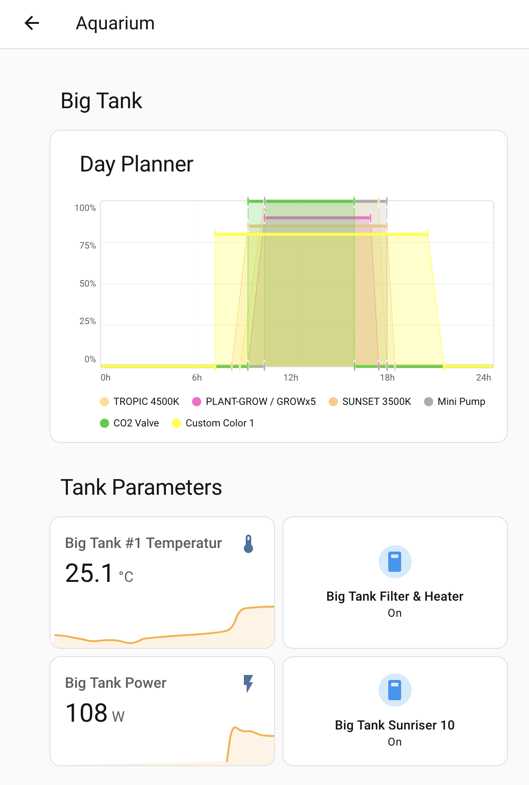

# SunRiser HA Integration

A community-made Home Assistant integration for the **SunRiser 8/10** LED aquarium controller by [LEDaquaristik](https://ledaquaristik.de). It communicates with the controller over your local network and is not affiliated with or supported by LEDaquaristik.

## Features

- **Lights and switches** — control active PWM channels and view their current output.
- **Planner controls** — select each channel's manager (`none`, `dayplanner`, `weekplanner`, or `fixed`) and set its fixed output value.
- **Sensors** — DS1820 readings, per-channel weather state, uptime, firmware version, hostname, and connectivity.
- **Controller controls** — Maintenance Mode, Blackout, Time-lapse, and Reboot. Firmware 1.006+ handles DST itself.
- **Maintenance settings** — optional timeout, per-channel levels and exclusions, plus operating mode and an optional estimated end time. Configuration entities and the end-time sensor are disabled by default; see [maintenance and blackout](configuration.md#maintenance-and-blackout-firmware-1006).
- **Day Planner card** — display stored channel schedules as a 24-hour chart using the controller's LED colours.
- **Actions** — back up and restore configuration, read logs, edit schedules, and download diagnostic files. Multiple controllers can be selected independently.
- **Options** — polling every {{ cfg.default_scan_interval }} seconds by default, with an optional daily reboot that defaults to off.

## Get started

1. [Install the integration](installation.md) through HACS and connect your controller.
2. [Configure entities and the Day Planner card](configuration.md).
3. Use [service actions](services.md) for backups and schedules.

Channel and probe changes are discovered during polling. Direct light and switch commands temporarily override the controller's program; see [manual control](troubleshooting.md#light-brightness-reverts-after-60-seconds) for persistent output settings.

## Help and development

- [Troubleshooting](troubleshooting.md)
- [Report an issue](https://github.com/MrInterBugs/ha-sunriser/issues)
- [API reference](api/index.md)
- [Source and contribution instructions](https://github.com/MrInterBugs/ha-sunriser)
